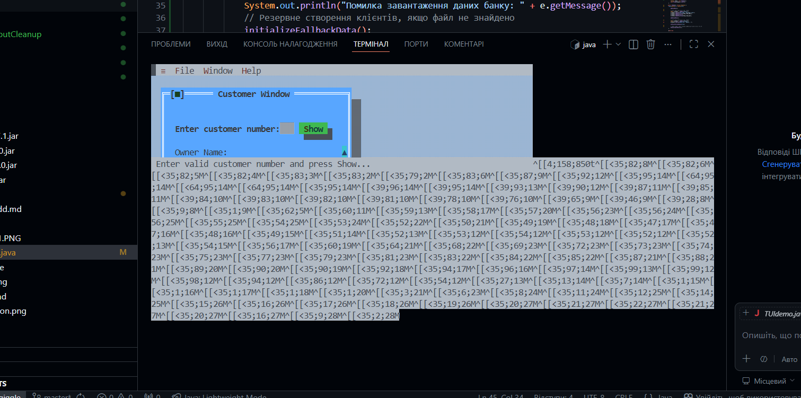
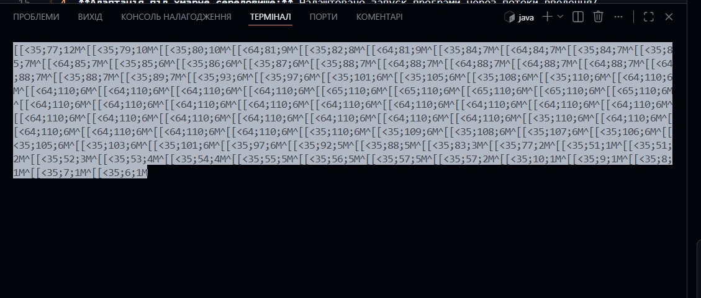
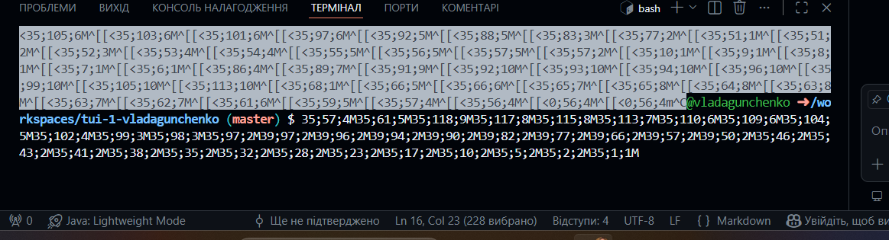

# Лабораторна робота: Створення багатовіконного TUI з допомогою Jexer
Гунченко Влада
35 група
Цей проект є доповненням до основного циклу лабораторних робіт (проект **Banking**) з дисципліни "Об'єктно-орієнтоване програмування".

## 🎯 Мета роботи
Навчитись створювати текстові інтерфейси користувача (TUI) у багатовіконному режимі за допомогою бібліотеки **Jexer**, а також інтегрувати розроблений інтерфейс із раніше створеною логікою управління банківськими рахунками та завантаженням даних із файлу.

---

## 🛠️ Виконане завдання (на оцінку "5")
1. **Інтеграція логіки проекту Banking:** Повністю переписано метод `ShowCustomerDetails` з використанням реальних бізнес-об'єктів банку (`Bank`, `Customer`, `Account`, `CheckingAccount`, `SavingsAccount`).
2. **Робота з базою даних:** Забезпечено автоматичне зчитування та парсинг даних клієнтів і їхніх рахунків із файлу даних `test.dat` за допомогою класу `DataSource` при старті програми.
3. **Динамічний вивід:** Реалізовано пошук клієнта за його індексом (ID) та виведення його повного імені, типу рахунку (Checking/Savings) і поточного балансу у текстове вікно Jexer.
4. **Адаптація під хмарне середовище:** Налаштовано запуск програми через потоки введення/виведення (`System.in`, `System.out`) для коректного відображення інтерфейсу безпосередньо всередині терміналу GitHub Codespaces (в обхід відсутності графічного X11 дисплея).

---

## 🚀 Інструкція із запуску програми в терміналі

Оскільки збірка через локальні Gradle-скрипти може конфліктувати з версіями JVM у хмарі, компіляція та запуск виконуються напряму через утиліти JDK:

